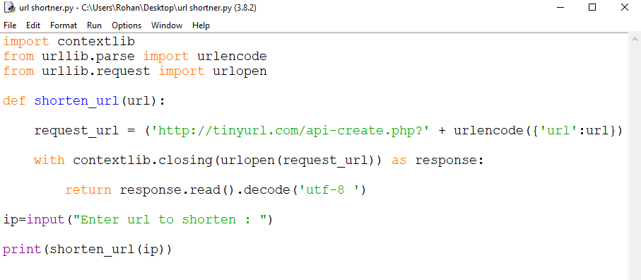
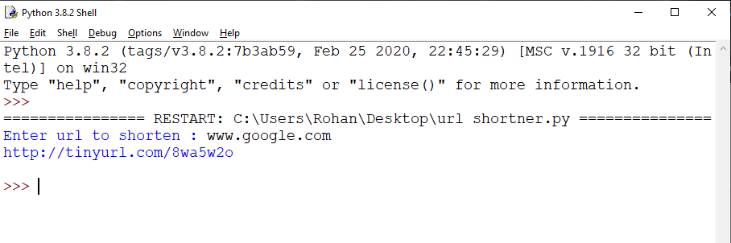

# url-shortner-using-python
#We can use this python program to shorten any links 

usage:-

First open the file in python idle which will look like the below picture

Then execute the code by pressing f5 or by navigating to run->run module

Input the link you want to shorten and then press enter

output will be as the shortened link as shown below in the picture

Now open browser and check the link we got in output as shown in the picture below 

Hit the enter button and you can see the link has redirected to the site you have entered in input

